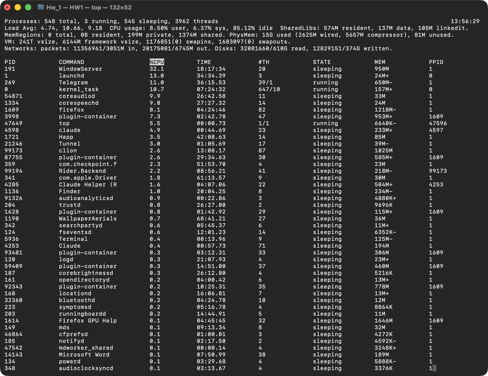
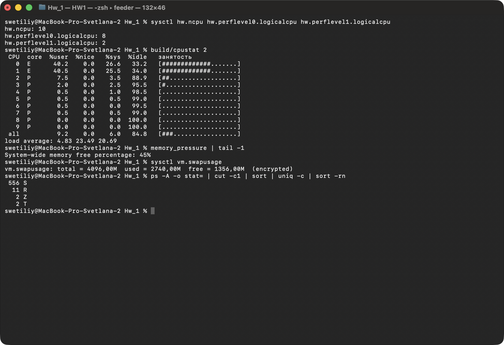
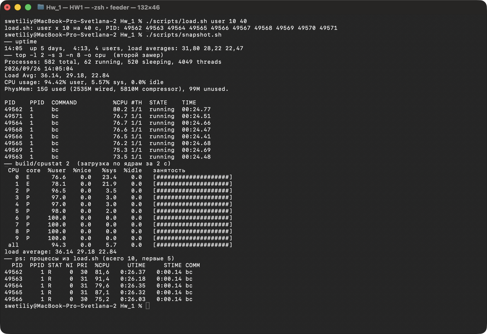
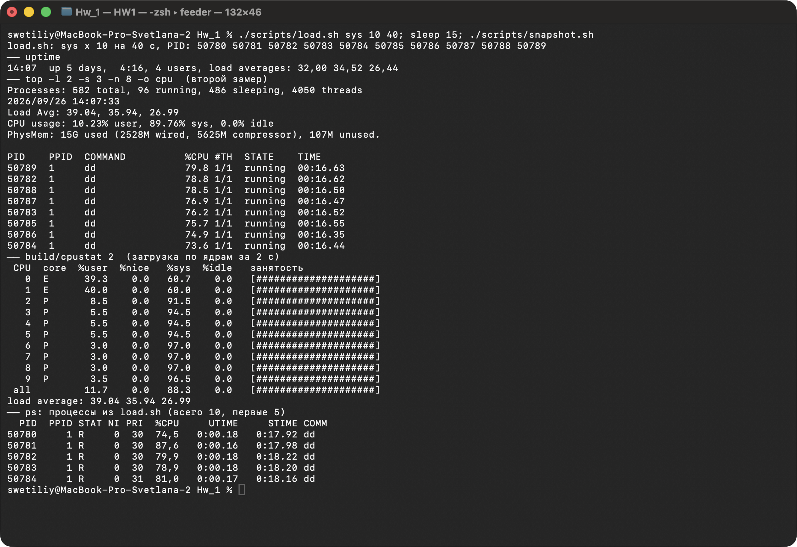
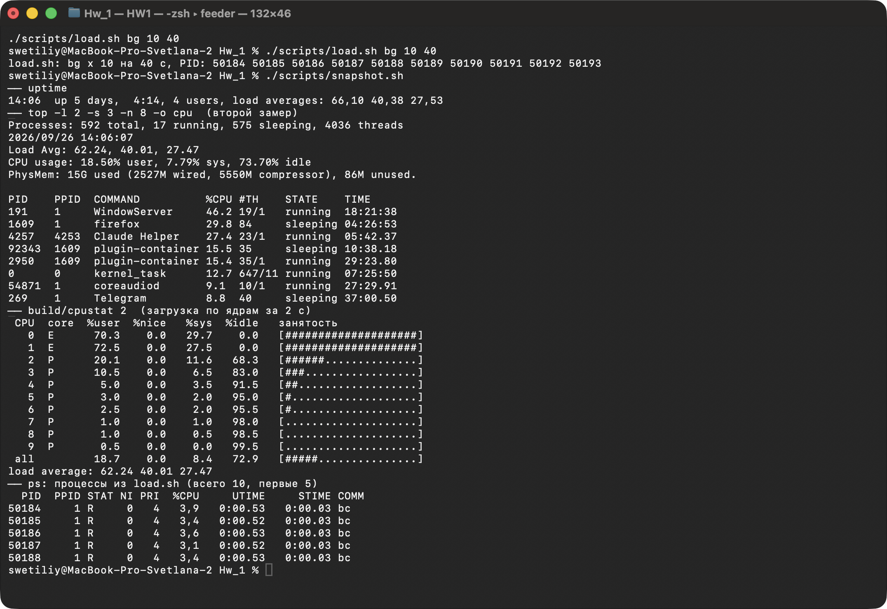
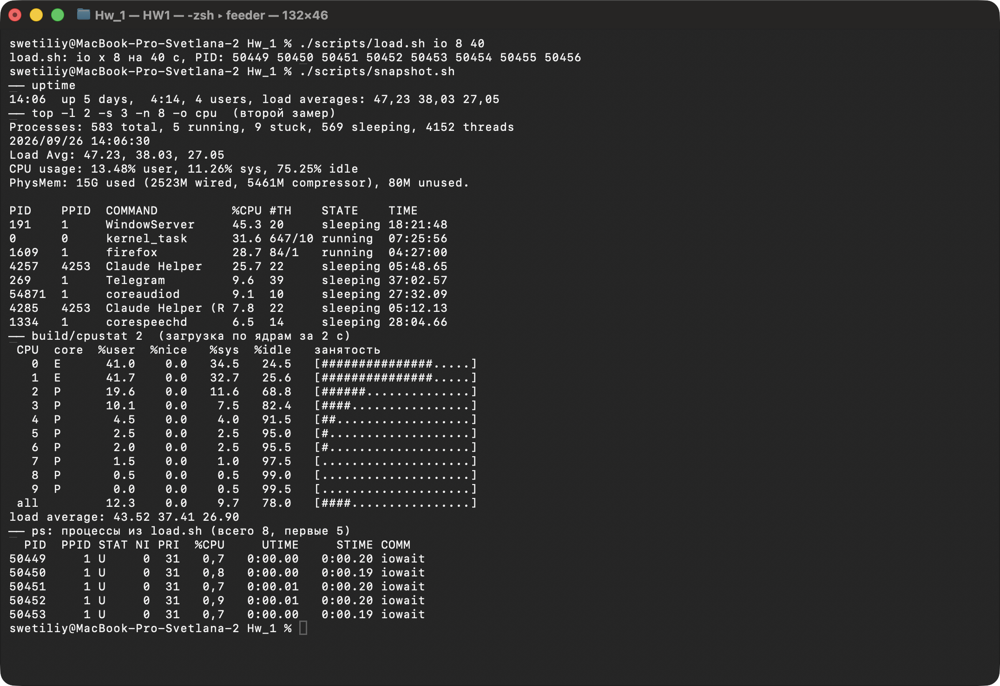

# ДЗ 1. Анализ загрузки процессора и системы в UNIX/Linux

Стенд: MacBook Pro, Apple M1 Pro (10 ядер: 8 производительных P + 2 энергоэффективных E), 16 ГБ, macOS 26.6.
macOS - сертифицированный UNIX (ядро XNU), поэтому все показано на нем, а Linux описан для сравнения.
Скриншоты сняты с окна Terminal на этой машине.

## Файлы

| Файл | Назначение |
|---|---|
| `src/cpustat.cpp` | загрузка каждого ядра (user / nice / sys / idle) через Mach API, аналог `mpstat` |
| `src/threads.cpp` | один процесс с N занятыми потоками |
| `src/iowait.cpp` | процесс, который все время ждет диск (`fcntl(F_FULLFSYNC)`) |
| `scripts/load.sh` | запуск нагрузки: `user`, `sys`, `nice`, `bg`, `threads`, `io`, `sleep` |
| `scripts/snapshot.sh` | снимок: `uptime` + `top` + загрузка по ядрам + процессы нагрузки |
| `CMakeLists.txt` | сборка программ |

```bash
cmake -B build && cmake --build build
./scripts/load.sh user 10 180    # 10 процессов на 180 секунд
./scripts/snapshot.sh
./scripts/load.sh stop
```

## 1. Load Average (LA)

**LA** - среднее число задач, которые хотят выполняться: работают на CPU или ждут в очереди к нему. Три числа - за 1, 5 и 15 минут.

- Где смотреть: `uptime`, `w`, `top`; в macOS `sysctl vm.loadavg`, в Linux `cat /proc/loadavg`.
- Как считается: раз в 5 секунд ядро берет число задач `n` и обновляет `LA = LA * e + n * (1 - e)`, где `e = exp(-5/60)` для 1 минуты (для 5 и 15 минут `exp(-5/300)` и `exp(-5/900)`). Это экспоненциальное сглаживание: при постоянной нагрузке `n` LA1 доходит до 63% от `n` за минуту и до 95% за 3 минуты.
- Как читать: LA не делится на число ядер, сравнивать нужно самому с `hw.ncpu` (в Linux `nproc`). LA меньше числа ядер - есть запас; примерно равен - CPU занят полностью; больше - задачи стоят в очереди.
- Тренд: LA1 > LA15 - нагрузка растет, LA1 < LA15 - спадает.
- Считаются потоки, а не процессы: один процесс с 10 занятыми потоками дает +10.

### Отличие UNIX и Linux

| | UNIX (BSD, Solaris, macOS) | Linux |
|---|---|---|
| что входит в LA | задачи в состоянии R: выполняются или готовы к выполнению | R **и D** (непрерываемое ожидание: диск, NFS, часть блокировок) |
| что показывает | спрос на процессор | спрос на процессор и ввод-вывод |
| высокий LA при свободном CPU | почти не бывает | обычное дело при медленном диске или зависшем NFS |

Linux учитывает D-состояние с 1993 года, чтобы LA показывал общую загруженность системы. Поэтому в Linux высокий LA еще не значит, что не хватает CPU: надо смотреть `top` (поле `wa`), `vmstat` (столбцы `r` и `b`) и процессы в состоянии D.

Проверка на macOS - рис. 6: 8 процессов `iowait` ждут диск в состоянии `U` (аналог D, в top - `stuck`), но LA не растет, а падает. В Linux эти 8 процессов добавили бы к LA около 8.

## 2. Нагружен ли сейчас сервер





- LA = 4.74 / 10.66 / 9.18 при 10 ядрах. Сейчас 0.47 на ядро, 5-15 минут назад было около 1 (шли тесты), нагрузка спадает.
- CPU: 8.5% user + 6.4% sys, **85% простаивает**. P-ядра почти свободны, E-ядра заняты на 65%: macOS отправляет на них фоновые службы.
- Больше всего CPU берут WindowServer (32%, вывод графики), launchd, Telegram, kernel_task, coreaudiod, firefox.
- Процессы: 556 S, 11 R, 2 T и 2 Z. Остановлен `Rider.Backend` (CLion), и два его потомка - зомби: CPU они не тратят и в LA не входят.
- Память: занято 15 ГБ из 16, из них 5.6 ГБ сжато; `memory_pressure` показывает 45% свободной, swap 2.7 ГБ из 4 ГБ.

**Вывод:** машина не нагружена. CPU простаивает на 85%, LA в 2 раза меньше числа ядер, очереди к процессору нет. Если что-то и близко к пределу, то это память (много сжатия и swap), а не процессор.

## 3. Информация о CPU в top

Заголовок `top` в macOS (рис. 1):

| Строка | Смысл |
|---|---|
| `Processes: 548 total, 3 running, 545 sleeping, 3962 threads` | процессы по состояниям и число потоков; `stuck` - в непрерываемом ожидании |
| `Load Avg: 4.74, 10.66, 9.18` | LA за 1, 5, 15 минут |
| `CPU usage: 8.50% user, 6.37% sys, 85.12% idle` | доля времени всех ядер: код программ / код ядра / простой |

Столбцы: `%CPU` - доля одного ядра (у многопоточного процесса больше 100%, максимум 1000% на 10 ядрах), `TIME` - сколько CPU-времени процесс потратил всего, `#TH` - потоков (`39/1` - всего / сейчас выполняется), `STATE` - `running`, `sleeping`, `stuck`, `stopped`, `zombie`.

В Linux `top` делит время CPU подробнее: `%Cpu(s): us sy ni id wa hi si st`.

| Linux | Что это | В macOS |
|---|---|---|
| `us` | код программ | `user` |
| `sy` | код ядра (системные вызовы) | `sys` |
| `ni` | программы с пониженным приоритетом (`nice`) | входит в `user`, счетчик NICE всегда 0 (видно в `cpustat`) |
| `id` | простой | `idle` |
| `wa` | простой, пока есть незавершенный ввод-вывод | входит в `idle` |
| `hi` / `si` | аппаратные / программные прерывания | входят в `sys` |
| `st` | время, отобранное гипервизором у виртуальной машины | нет |

Полезные клавиши Linux `top`: `1` - каждое ядро отдельно, `P` - сортировка по CPU, `Shift+I` - делить %CPU на число ядер.

## 4*. Варианты загрузки CPU

Каждый вариант запускался `./scripts/load.sh РЕЖИМ 10 40`, через 15-25 секунд делался `./scripts/snapshot.sh`. Варианты шли подряд, поэтому LA на рис. 4-6 еще содержит хвост от предыдущих.

| Режим | Команда | Что видно |
|---|---|---|
| user | 10 x `bc -l` считает pi | 94% user, все 10 ядер заняты, у процессов почти все время `UTIME` |
| sys | 10 x `dd if=/dev/zero of=/dev/null bs=1m` | 90% sys: работу делает ядро, у процессов почти все время `STIME` |
| bg | 10 x `bc` через `taskpolicy -c background` | заняты только 2 E-ядра, P-ядра свободны, 74% простоя, приоритет 4 |
| io | 8 x `build/iowait` | 8 процессов `stuck` (U), CPU свободен на 75%, LA падает |

### user



Все ядра заняты на 100%, из них 94% - user. LA за 25 секунд вырос с 5 до 36, хотя процессов bc всего 10 (а в top 62 running): когда все ядра заняты, в очередь встают и потоки остальных программ, а macOS считает в LA все готовые к выполнению потоки.

### sys



`dd` читает нули из `/dev/zero` и пишет в `/dev/null`: работу делает ядро, поэтому растет `sys`, а у процессов растет `STIME`, а не `UTIME`. Интересно, что `yes > /dev/null` в macOS тоже грузит в основном ядро: на каждый вывод - системный вызов `write`.

### bg: фоновый QoS (особенность macOS на Apple Silicon)



Те же 10 `bc`, но с классом QoS background. Планировщик пускает их только на 2 E-ядра: они заняты на 100%, P-ядра простаивают, общий простой 74%. Задачи при этом стоят в очереди, поэтому LA высокий. Пример того, что и в UNIX высокий LA не всегда значит «процессор занят».

### io: ожидание диска



8 процессов `iowait` в состоянии `U` (`stuck` в top), CPU у них около 1%. LA при этом падает (47 -> 44): в macOS ожидание диска в LA не входит. В Linux это были бы D-процессы, LA вырос бы примерно на 8, а в `top` появился бы `wa`.

### Что еще можно показать

- `./scripts/load.sh nice 10` вместе с `user 10`: 20 задач на 10 ядер, процессы с `nice 20` получают меньше CPU, а их время идет в `user`.
- `./scripts/load.sh threads 10`: один процесс, в top `%CPU` около 1000% и `#TH` 11.
- `./scripts/load.sh sleep 100`: 100 спящих процессов (S) не меняют LA ни в UNIX, ни в Linux.

## Выводы

- LA - длина очереди к ресурсам, а не процент загрузки CPU. Сравнивать с числом ядер и смотреть на тренд 1/5/15.
- UNIX (и macOS) считает только готовые к работе задачи, Linux еще и ждущие ввода-вывода (D). Поэтому в Linux высокий LA бывает при свободном процессоре.
- Сейчас машина не нагружена: 85% простоя, LA около 0.5 на ядро; ближе к пределу память.
- `top` показывает, на что уходит CPU: в macOS user / sys / idle, в Linux подробнее us / sy / ni / id / wa / hi / si / st.

Источники: `man uptime`, `man top`, `man taskpolicy`; ядро Linux `kernel/sched/loadavg.c`; статья Brendan Gregg «Linux Load Averages: Solving the Mystery».
